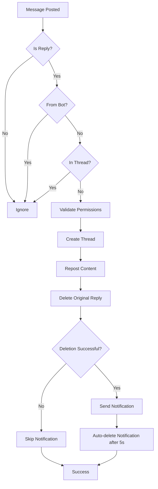

# Contributing to Thread It 🤝

We welcome contributions to Thread It! This guide will help you get started with contributing to the project.

## 📋 Table of Contents

- [Development Setup](#-development-setup)
- [Code Style Guidelines](#-code-style-guidelines)
- [Testing Requirements](#-testing-requirements)
- [Submitting Changes](#-submitting-changes)
- [Reporting Issues](#-reporting-issues)
- [Code of Conduct](#-code-of-conduct)
- [API Documentation](#-api-documentation)

## 🚀 Development Setup

### Prerequisites

- Python 3.9 or higher
- Git
- A Discord bot token for testing
- A test Discord server

### Step 1: Fork and Clone

1. **Fork the repository** on GitHub
2. **Clone your fork** locally:
   ```bash
   git clone https://github.com/your-username/thread-it.git
   cd thread-it
   ```

### Step 2: Set Up Development Environment

1. **Create a virtual environment**:

   ```bash
   python -m venv venv
   source venv/bin/activate  # On Windows: venv\Scripts\activate
   ```

2. **Install dependencies**:

   ```bash
   pip install -r requirements.txt
   ```

3. **Set up environment variables**:
   ```bash
   cp .env.example .env
   # Edit .env with your test bot token
   ```

### Step 3: Create a Feature Branch

```bash
git checkout -b feature/your-feature-name
```

Use descriptive branch names:

- `feature/add-thread-archiving`
- `bugfix/permission-validation`
- `docs/update-installation-guide`

## 📝 Code Style Guidelines

### Python Style

- **Follow PEP 8** Python style guidelines
- **Use type hints** where appropriate
- **Add docstrings** to all functions and classes
- **Keep functions focused** and single-purpose
- **Use meaningful** variable and function names

### Example Code Style

```python
async def create_thread_from_reply(self, reply_info: Dict[str, Any]) -> Optional[discord.Thread]:
    """
    Create a public thread from reply information.

    Args:
        reply_info: Dictionary containing reply and parent message information

    Returns:
        The created thread, or None if creation failed
    """
    try:
        parent_message = reply_info['parent_message']
        thread_name = Config.get_thread_name(parent_message.content)

        thread = await parent_message.create_thread(
            name=thread_name,
            auto_archive_duration=Config.DEFAULT_AUTO_ARCHIVE_DURATION
        )

        return thread
    except Exception as e:
        self.logger.error(f"Failed to create thread: {e}")
        return None
```

### Documentation Style

- Use clear, concise language
- Include code examples where helpful
- Document all parameters and return values
- Explain the purpose and behavior of functions

## 📤 Submitting Changes

### Commit Guidelines

1. **Write clear commit messages**:

   ```bash
   git commit -m "feat: automatic thread archiving after 7 days"
   git commit -m "fix: handle permission errors gracefully"
   git commit -m "docs: add troubleshooting section for rate limits"
   ```

2. **Keep commits focused**: One logical change per commit
3. **Use present tense**: "add feature" not "added feature"

### Pull Request Process

1. **Push to your fork**:

   ```bash
   git push origin feature/your-feature-name
   ```

2. **Create a Pull Request** on GitHub with:
   - **Clear title** describing the change
   - **Detailed description** of what was changed and why
   - **Reference any related issues** using `#issue-number`
   - **Screenshots** if UI/behavior changes are involved
   - **Testing notes** describing how you tested the changes

## 📚 API Documentation

### Core Classes

#### `ThreadItBot`

The main bot class that handles Discord events and thread creation.

**Key Methods:**

- `on_message(message)`: Main event handler for processing message replies
- `process_reply_to_thread(message)`: Orchestrates the reply-to-thread conversion
- `create_thread_from_reply(reply_info)`: Creates a new thread from reply information
- `repost_reply_in_thread(thread, reply_info)`: Reposts reply content in the created thread
- `cleanup_messages(reply_info)`: Handles message cleanup and user notifications
- `delete_original_reply(reply_info)`: Deletes the original reply message
- `send_temporary_notification(reply_info)`: Sends auto-deleting notification to guide users
- `validate_permissions(channel)`: Validates bot permissions in a channel

#### `Config`

Configuration management class containing all bot settings.

**Key Methods:**

- `validate()`: Validates that required configuration is present
- `get_thread_name(content)`: Generates thread names from message content

**Configuration Constants:**

```python
DEFAULT_AUTO_ARCHIVE_DURATION = 1440  # 24 hours in minutes
MAX_THREAD_NAME_LENGTH = 100          # Discord's thread name limit
```

### Event Flow



### Required Discord Permissions

| Permission               | Purpose                            |
| ------------------------ | ---------------------------------- |
| View Channels            | Read messages in channels          |
| Send Messages            | Send messages in main channels     |
| Send Messages in Threads | Send messages in created threads   |
| Create Public Threads    | Create threads on messages         |
| Manage Messages          | Delete original reply messages     |
| Read Message History     | Access message history for context |

### Gateway Intents

- **Message Content Intent** (Privileged): Required to read message content

## 📜 Code of Conduct

### Our Standards

- **Be respectful and inclusive** to all contributors
- **Focus on constructive feedback** that helps improve the project
- **Help others learn and grow** in their development journey
- **Follow Discord's Terms of Service** and Community Guidelines
- **Respect different viewpoints** and experiences

### Unacceptable Behavior

- Harassment, discrimination, or offensive comments
- Trolling, insulting, or derogatory comments
- Publishing private information without permission
- Any conduct that would be inappropriate in a professional setting

### Enforcement

Project maintainers are responsible for clarifying standards and will take appropriate action in response to unacceptable behavior.

---

## 🙏 Thank You

Thank you for contributing to Thread It! Your efforts help make Discord servers more organized and user-friendly for everyone.

For questions about contributing, feel free to:

- Open an issue for discussion
- Check existing issues and pull requests
- Review the main [README.md](../README.md) for project overview

**Happy coding!** 🎉
