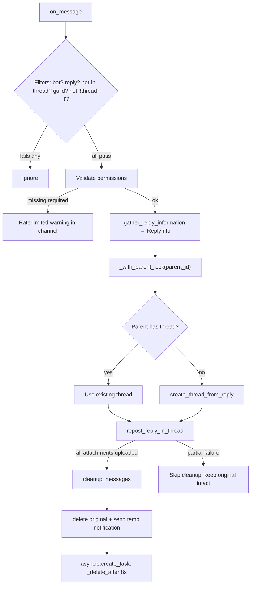

# Contributing to Thread It 🤝

We welcome contributions to Thread It! This guide will help you get started with contributing to the project.

## 📋 Table of Contents

- [Development Setup](#-development-setup)
- [Code Style Guidelines](#-code-style-guidelines)
- [Testing Requirements](#-testing-requirements)
- [Submitting Changes](#-submitting-changes)
- [Reporting Issues](#-reporting-issues)
- [Code of Conduct](#-code-of-conduct)
- [API Documentation](#-api-documentation)

## 🚀 Development Setup

### Prerequisites

- Python 3.13 or higher
- Git
- A Discord bot token for testing
- A test Discord server

### Step 1: Fork and Clone

1. **Fork the repository** on GitHub
2. **Clone your fork** locally:
   ```bash
   git clone https://github.com/your-username/thread-it.git
   cd thread-it
   ```

### Step 2: Set Up Development Environment

1. **Create a virtual environment**:

   ```bash
   python -m venv venv
   source venv/bin/activate  # On Windows: venv\Scripts\activate
   ```

2. **Install dependencies**:

   ```bash
   # Runtime only
   pip install -r requirements.txt

   # Or development (adds ruff, mypy, pytest, pytest-asyncio)
   pip install -r requirements-dev.txt
   ```

3. **Set up environment variables**:
   ```bash
   cp .env.example .env
   # Edit .env with your test bot token
   ```

### Dev commands

```bash
ruff check .                          # lint
ruff check --fix .                    # auto-fix what ruff can
mypy bot.py config.py threadit/       # type-check
pytest                                # run tests
pytest -k <name>                      # run a single test
pytest --cov=threadit --cov=config    # with coverage (install pytest-cov first)
```

CI runs all three on every PR — see `.github/workflows/ci.yml`.

### Step 3: Create a Feature Branch

```bash
git checkout -b feature/your-feature-name
```

Use descriptive branch names:

- `feature/add-thread-archiving`
- `bugfix/permission-validation`
- `docs/update-installation-guide`

## 📝 Code Style Guidelines

### Python Style

- **Follow PEP 8** Python style guidelines
- **Use type hints** where appropriate
- **Add docstrings** to all functions and classes
- **Keep functions focused** and single-purpose
- **Use meaningful** variable and function names

### Example Code Style

```python
async def create_thread_from_reply(self, reply_info: ReplyInfo) -> discord.Thread | None:
    """Create a public thread from the parent message."""
    try:
        parent_message = reply_info.parent_message
        thread_name = Config.get_thread_name(parent_message.content)
        return await parent_message.create_thread(
            name=thread_name,
            auto_archive_duration=Config.DEFAULT_AUTO_ARCHIVE_DURATION,
        )
    except discord.Forbidden:
        self.logger.error(f"Missing permissions on message {parent_message.id}")
        return None
    except discord.HTTPException as e:
        self.logger.error(f"HTTP error creating thread: {e}")
        return None
```

Note: `reply_info` is a frozen `ReplyInfo` dataclass (`threadit/types.py`), not a dict. Use `dataclasses.replace()` to produce updated copies.

### Documentation Style

- Use clear, concise language
- Include code examples where helpful
- Document all parameters and return values
- Explain the purpose and behavior of functions

## 🧪 Testing Requirements

### Automated tests (mandatory)

Every PR must keep `pytest` green. New behavior needs new tests — see `tests/`
for examples. The suite is fast (<1s) and runs without any Discord network:

```bash
pytest
```

Services in `threadit/` are designed to be unit-testable in isolation:
`PermissionsService`, `ThreadingOrchestrator`, and the `build_attachment_files`
helper each take their dependencies as constructor args / callables. See
`tests/test_permissions.py` and `tests/test_orchestrator.py` for patterns.

### Manual smoke test (recommended before merging anything user-facing)

Set up a personal test Discord server and invite your dev bot with all
required permissions (View Channels, Send Messages, Send Messages in Threads,
Create Public Threads, Read Message History, Embed Links, Attach Files,
Manage Messages). Then walk this checklist:

- [ ] Bot starts: `python bot.py` connects without errors; the `/thread-it`
      command appears in Discord's slash-command picker after sync.
- [ ] **Happy path**: reply to a message → a thread is created on the parent,
      your reply is reposted in the thread inside an attribution embed
      (author avatar + display name + timestamp), the original reply is
      deleted, a short notification message appears for ~8 seconds.
- [ ] **Attachment**: reply with an image attached → it's re-uploaded into
      the thread post.
- [ ] **Oversize attachment**: reply with a file > `MAX_ATTACHMENT_BYTES`
      (default 25 MiB) → original is NOT deleted, log shows the skip.
- [ ] **Concurrent burst**: reply to the same parent from two clients within
      ~1 second → exactly one thread is created, both replies end up inside
      it.
- [ ] **Missing perms**: revoke `Embed Links` from the bot role → first
      reply produces a single in-channel warning; further replies within an
      hour are silent.
- [ ] **DM**: send `!thread-it` to the bot in DMs → help text returned
      without permission block; no traceback.
- [ ] **Slash command**: `/thread-it` in a configured channel → ephemeral
      help reply visible only to you.

Note any unexpected behavior or log warnings in your PR description.

## 📤 Submitting Changes

### Commit Guidelines

1. **Write clear commit messages**:

   ```bash
   git commit -m "feat: automatic thread archiving after 7 days"
   git commit -m "fix: handle permission errors gracefully"
   git commit -m "docs: add troubleshooting section for rate limits"
   ```

2. **Keep commits focused**: One logical change per commit
3. **Use present tense**: "add feature" not "added feature"

### Pull Request Process

1. **Push to your fork**:

   ```bash
   git push origin feature/your-feature-name
   ```

2. **Create a Pull Request** on GitHub with:
   - **Clear title** describing the change
   - **Detailed description** of what was changed and why
   - **Reference any related issues** using `#issue-number`
   - **Screenshots** if UI/behavior changes are involved
   - **Testing notes** describing how you tested the changes

## 🚨 Reporting Issues

If you encounter bugs or have feature requests, please open an issue on GitHub.
Include the following details when reporting a problem:

- Steps to reproduce the issue
- What you expected to happen
- What actually happened (include console output if possible)

## 📚 Project Architecture

```
bot.py                  # entry: build commands.Bot, wire services, run
config.py               # Config class, get_thread_name, _int_env
threadit/
  __init__.py
  types.py              # ReplyInfo dataclass, DEFAULT_CLIENT_ID, invite_url
  attachments.py        # build_attachment_files (size-capped download)
  permissions.py        # PermissionsService (validation + cooldown + warnings)
  orchestrator.py       # ThreadingOrchestrator (reply→thread flow)
  cog.py                # ThreadItCog (gateway listeners + /thread-it command)
tests/                  # pytest suite, runs without Discord network
```

### Layer responsibilities

- **`bot.py`** wires everything but owns no logic. If a change is purely
  about gateway intents, prefix, or startup sequencing, edit here.
- **`threadit/cog.py`** translates gateway events into orchestrator calls
  and serves the user-facing `/thread-it` (and legacy `!thread-it`) help
  command. Filters (bot/non-reply/thread/DM) live here.
- **`threadit/orchestrator.py`** owns the reply→thread state machine: the
  per-parent `_with_parent_lock`, `gather_reply_information`, thread
  creation, repost, cleanup, and the deferred notification auto-delete.
- **`threadit/permissions.py`** is the single source of truth for what
  permissions are required and how the per-channel warning cooldown works.
- **`threadit/types.py`** is for shared, dependency-free pieces.

### Event flow


```mermaid
graph TD
    A[on_message] --> B{Filters: bot? reply? not-in-thread? guild? not '!thread-it'?}
    B -->|fails any| C[Ignore]
    B -->|all pass| D[Validate permissions]
    D -->|missing required| E[Rate-limited warning in channel]
    D -->|ok| F[gather_reply_information → ReplyInfo]
    F --> G["_with_parent_lock(parent_id)"]
    G --> H{Parent has thread?}
    H -->|yes| I[Use existing thread]
    H -->|no| J[create_thread_from_reply]
    I --> K[repost_reply_in_thread]
    J --> K
    K -->|all attachments uploaded| L[cleanup_messages]
    K -->|partial failure| M[Skip cleanup, keep original intact]
    L --> N[delete original + send temp notification]
    N --> O[asyncio.create_task: _delete_after 8s]
```

### Config

`Config` (in `config.py`) holds all settings, validated at startup. Notable
fields:

```python
DEFAULT_AUTO_ARCHIVE_DURATION       # 1440 (24h)
MAX_THREAD_NAME_LENGTH              # 100 (Discord's limit)
MAX_ATTACHMENT_BYTES                # 25 MiB; env-overridable
PERMISSION_WARNING_COOLDOWN_SECONDS # 3600; env-overridable
```

### Required Discord permissions / intents

See the [README](../README.md#-required-permissions) for the full table.
`Embed Links` is required (the bot always posts via `discord.Embed`);
`Attach Files` is required only when the reply being processed carries
attachments.

## 📜 Code of Conduct

### Our Standards

- **Be respectful and inclusive** to all contributors
- **Focus on constructive feedback** that helps improve the project
- **Help others learn and grow** in their development journey
- **Follow Discord's Terms of Service** and Community Guidelines
- **Respect different viewpoints** and experiences

### Unacceptable Behavior

- Harassment, discrimination, or offensive comments
- Trolling, insulting, or derogatory comments
- Publishing private information without permission
- Any conduct that would be inappropriate in a professional setting

### Enforcement

Project maintainers are responsible for clarifying standards and will take appropriate action in response to unacceptable behavior.

---

## 🙏 Thank You

Thank you for contributing to Thread It! Your efforts help make Discord servers more organized and user-friendly for everyone.

For questions about contributing, feel free to:

- Open an issue for discussion
- Check existing issues and pull requests
- Review the main [README.md](../README.md) for project overview

**Happy coding!** 🎉
